# Sumi 墨 — 架构设计与核心流程

> 状态: v1.1 · 与 `docs/PRD.md` 配套，描述当前已实现的系统架构、数据模型与关键业务流程。
> 更新日期: 2026-08-07（v1.2: 移除可选遗留 GitHub 内容后端，内容只存 Postgres `sumi_*` 表 / Cloudflare D1+R2）

---

## 1. 概述

Sumi 是一个开源的**个人空间门户**（对标 mx-space / Shiro 的产品形态:首页门户 + 文章 + 手记 + 标签体系），
  同时保留多创作者协作能力（allowlist 门禁下的 GitHub 登录）。它的核心设计理念是:

- **内容即数据**: 所有文章、图片、评论、杂志都以结构化内容的形式存入**创作者自己的数据库**——Postgres `sumi_*` 表（Docker / VPS / Vercel）或 Cloudflare D1+R2，天然可迁移、可版本化、可搜索。
- **账号与内容分离**: 登录/会话数据放在 Postgres / D1，内容数据也放在同一套数据库（或 Cloudflare D1+R2），通过 `ContentStore` 抽象统一读写。
- **Serverless 友好**: 不在本地文件系统写内容，所有读写都走数据库绑定 / ContentStore 接口，可部署到 Cloudflare Workers、Docker 自托管或自定义 VPS。

一句话概括数据流:**GitHub OAuth 登录 → 会话库存会话 → 内容读写走 ContentStore（Postgres DbContentStore 或 Cloudflare D1+R2）**。

---

## 2. 系统架构总览


**强调**: 页面渲染是 SSR（`export const dynamic = "force-dynamic"`），每次请求实时从当前内容后端（Postgres / D1）读取，因此"发布即生效、无需重新部署"。

---

## 3. 技术栈

| 层 | 技术 | 用途 |
|---|---|---|
| 框架 | Next.js 16 (App Router) + React 19 + TypeScript | SSR 页面 / Server Actions / API 路由 |
| 样式 | Tailwind CSS 4 + `@tailwindcss/typography` | 设计令牌（墨纸朱印）+ 阅读排版 |
| 字体/图标 | `next/font` Geist + Newsreader / `@phosphor-icons/react` | 无衬线 UI + 衬线阅读字体;单一图标族 |
| 动效 | `motion`（CSS 令牌 `.rise/.lift/.press` 为主） | 入场、卡片 lift、按压缩放 |
| 编辑器 | TipTap 3 + `tiptap-markdown` | 富文本 ↔ Markdown 双向转换 |
| Markdown | `gray-matter`(frontmatter) + `react-markdown` + `remark-gfm` | 解析/序列化与渲染 |
| 认证 | Better Auth + GitHub OAuth | 登录、会话、allowlist 门禁 |
| ORM | Drizzle + `postgres`(postgres-js) | Postgres 访问（Neon 兼容） |
| 内容层 | `DbContentStore`（Drizzle + postgres-js） | Postgres `sumi_*` 主存储读写 |
| 校验 | zod | env / 表单 / 输入校验 |
| 测试 | Vitest + PGlite + vite-tsconfig-paths | 单测、auth 门禁、内容 store |
| 部署 | Docker compose（一键自托管, :3005）/ VPS 脚本 / Cloudflare Workers (OpenNext) | Docker/VPS 用 `output: "standalone"`，CF 由 OpenNext 复用该产物 |

---

## 4. 分层与模块

### 4.1 表现层（页面与组件）
- `src/app/*` — App Router 页面:**门户首页**（身份区 + 最新文章 + 标签云）、文章页 `/[handle]/[slug]`、创作者页 `/[handle]`、手记时间线 `/[handle]/notes`、友链页 `/friends`、标签库 `/tags` 与标签页 `/tag/[slug]`、搜索 `/search`、写作 `/write`、杂志 `/write/magazines`、设置 `/settings`、登录 `/sign-in`。
- `src/components/*` — 客户端组件:TipTap 编辑器、评论表单、杂志表单、资料表单、导航栏等。
- 公共读页面一律通过 `getReadContentStore()`（按配置选择 Postgres `DbContentStore` / Cloudflare D1+R2），无需登录即可浏览。

**UI 设计系统（ink-on-paper）**: 全局令牌定义在 `src/app/globals.css` 的 `@theme` 中:
- 配色: 纸 `paper #f7f4ec` 系 + 墨 `ink #1e1b16` 系 + 单一朱印色 `seal #b3402e`（亮/暗双模式）。
- 字体: 无衬线 `Geist`（UI）+ 衬线 `Newsreader`（阅读正文与标题），经 `next/font/google` 自托管。
- 形状: 卡片 14px / 输入 10px / 交互元素 pill 的统一圆角规则;阴影按背景色着色。
- 动效: `.rise` 入场、`.lift` 卡片悬停、`.press` 按压反馈，均包裹 `prefers-reduced-motion`。
- 品牌: 首页门户含身份区（统计数字、墨印卡片 CTA）、最新文章索引（日期栏 + 悬停位移）、标签云（按使用量缩放字号）。

### 4.2 应用层（Server Actions 与 API）
- `src/app/write/actions.ts` + `actions-core.ts` — 保存/删除文章、图片上传（`"use server"`）。
- `src/app/community/actions.ts` + `actions-core.ts` — 评论、资料、杂志、手记、友链的增删改。
- `src/app/api/auth/[...all]/route.ts` — 将 Better Auth 挂到 Next 的 catch-all 路由（GET/POST）。
- 每个 action 都先经过 `resolveDeps()`（`src/lib/session.ts`）解析「当前用户 id / handle / content store」，再由 `guard()` 校验登录态与配置。

### 4.3 服务层（核心库）
- `src/lib/auth.ts` — Better Auth 单例（惰性 Proxy），GitHub OAuth + 自定义 `username` 字段 + allowlist 门禁 hook + 内置按 IP 限流 + 登录审计日志。
- `src/lib/crypto.ts` — AES-256-GCM 落库加密助手：AI provider API Key 用主密钥
  （`BETTER_AUTH_SECRET` 派生）加密后写入 `sumi_ai_providers`，DB 泄露不暴露第三方密钥。
- `src/lib/env.ts` — zod 校验环境变量，惰性加载单例。
- `src/lib/db.ts` — Drizzle + postgres-js 惰性单例。
- `src/lib/current-user.ts` / `session.ts` / `user.ts` — 会话与 handle 解析。

### 4.4 内容层（ContentStore 抽象）
- `src/content/store.ts` — `ContentStore` 接口（文章/评论/杂志/资料/图片/手记/友链的统一读写，是 Postgres / Cloudflare 两后端共用的接缝）。
- `src/content/db-content-store.ts` / `cloudflare-content-store.ts` — 同一接口的两个实现（Postgres 主存储 / D1+R2），手记与友链在两个后端行为一致。
- `src/content/frontmatter.ts` — Markdown ↔ frontmatter 序列化/解析（含手记）。
- `src/content/paths.ts` — 仓库目录约定与 slug 规则。
- `src/content/types.ts` — 领域类型（`Post / Comment / Magazine / Profile`，以及手记 `Note`、友链 `Friend`）。
- `src/content/feed.ts` — 聚合各创作者的已发布文章，按 `publishedAt` 倒序。
- `src/content/index.ts` — 工厂函数：`getReadContentStore()`（匿名读）与 `getContentStoreForUser()`（用 OAuth token 写）。

---

## 5. 数据模型

### 5.1 关系库 (Postgres / Neon) — 认证、会话与 agent 密钥

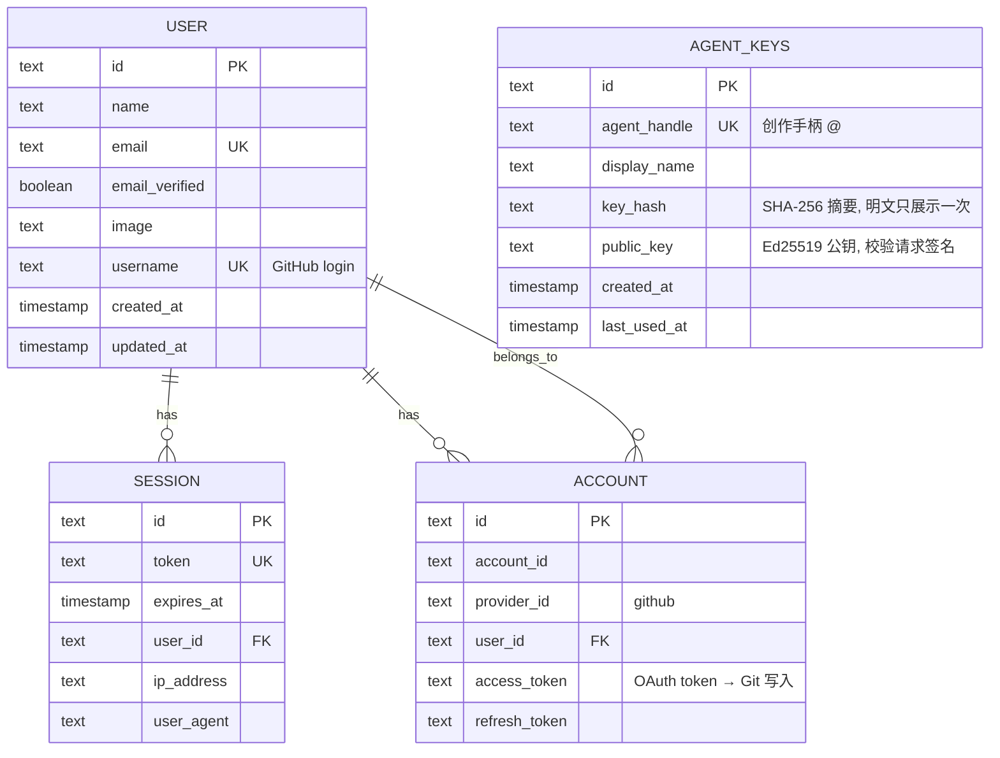

- 认证表 `user` / `session` / `account` / `verification`（`src/db/schema.ts`）。
- `agent_keys`（`src/db/schema.ts`）为 agent 发布服务：只存 SHA-256 密钥摘要与
  Ed25519 公钥，`scripts/create-agent.ts` 一次性签发明文 bearer key + 私钥 JWK。
- `account.access_token` 存 GitHub OAuth token；内容读写走服务端配置的
  Postgres / D1 后端，不需要该 token。
- `user.username` 存 GitHub login（`mapProfileToUser` 写入），是内容路径 `@<handle>` 的来源。

### 5.2 内容存储 — 所有创作者内容

**默认（主存储）**: Postgres `sumi_*` 表（`DbContentStore`，`DB_MIRROR=1`），或
Cloudflare D1+R2（`CF_ENABLED=1`）。Postgres / D1 用同构的表结构承载相同内容
（`sumi_posts` / `sumi_comments` / `sumi_magazines` / `sumi_profiles` /
`sumi_notes` / `sumi_friends` 等）。

- 每篇文章一行 `sumi_posts`：frontmatter 字段（`title / tags / status / publishedAt / excerpt / coverImage`）+ Markdown 正文。
- 图片经上传接口存入 R2（Cloudflare）或 base64 入库（Postgres），随文章存储。
- 评论在 `sumi_comments`（flat、time-ordered），支持 `parent` 引用形成嵌套回复。
- 杂志（合集）：`sumi_magazines`，frontmatter 含 `title / description / items[]`。
- 资料：`sumi_profiles`，frontmatter 含 `displayName / bio`。
- 手记（时间线）：`sumi_notes`，frontmatter 含 `author / date`，按 `date` 降序列出。
- 友链：站点级 `sumi_friends`，数组 `{ friends: [{ id, name, url, avatar?, bio?, createdAt }] }`，按 `createdAt` 升序展示。
- `paths.ts` 集中定义 slug 规则，`slugify()` 负责标题转 slug。

> Postgres 主存储（`DbContentStore`）用 `sumi_*` 表承载同样的数据；Cloudflare D1 用 `notes` / `friends` 表，建表 SQL 见 `drizzle/d1-schema.sql`（`drizzle/*.sql` 迁移为 Postgres 方言，不适用于 D1）。

### 5.3 AI 总结存储（Postgres 镜像专属）

AI 功能依赖 Postgres 镜像（`DB_MIRROR=1`），通过独立的 `AiStore` 接缝
（`src/content/ai-store.ts` 接口 + `src/content/db-ai-store.ts` 实现）读写两张表；
Cloudflare D1 后端 `getAiStore()` 返回 null，功能优雅降级：

- `sumi_ai_providers` — 按 creator handle 一行：`base_url / api_key / model / enabled / updated_at`。
  API Key 以 `enc:v1:<iv>:<tag>:<cipher>` 形式 **AES-256-GCM 加密落库**（密钥由
  `BETTER_AUTH_SECRET` 派生，仅存环境变量、不存库），页面只回传「是否已配置」的
  占位符，绝不回显明文；`scripts/encrypt-ai-keys.ts` 可把历史明文 key 一次性升级为密文。
- `sumi_ai_tasks` — 按文章去重的一行任务：`handle + post_slug + kind(summary) +
  status(pending/running/done/failed) + result(JSON: summary+tldr+points) + error + model`。

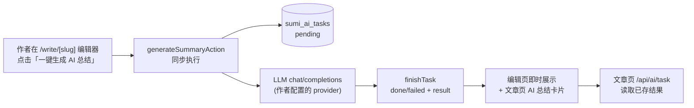

---

## 6. 核心业务流程（Flow 图）

### 6.1 登录认证（GitHub OAuth + Allowlist 门禁）

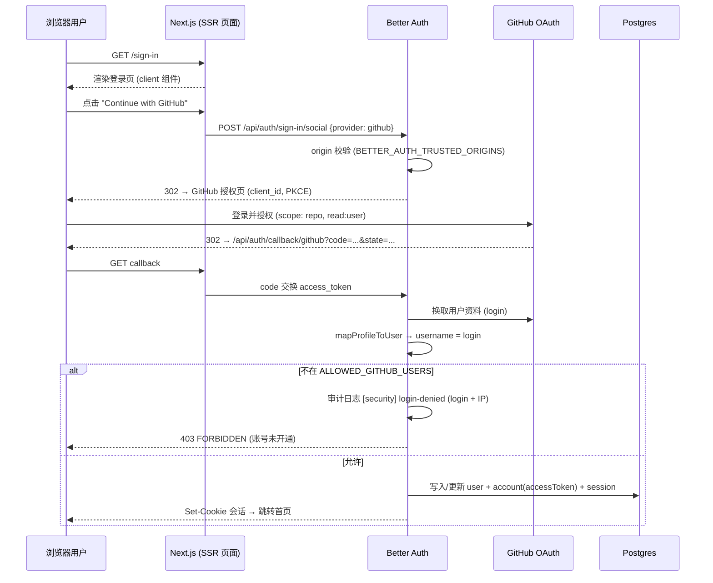

登录安全阀（全部默认开启）：
- **fail-closed allowlist**：`ALLOWED_GITHUB_USERS` 为空时拒绝所有登录；生产环境
  为空会在启动时直接报错（防误配置锁死自己），本地开发保持「拒绝所有人」。
- **origin 白名单**：`BETTER_AUTH_TRUSTED_ORIGINS`（逗号分隔）已接入
  better-auth `trustedOrigins`——除 `BETTER_AUTH_URL` 外，只有列表内的来源才能
  发起 OAuth 流程或接收会话 Cookie（CSRF 兜底）；`.env` 已随模板提供该变量。
- **双重门禁**：每次登录（user-create / session-create hook）与每个请求
  （`getCurrentUser` 内 `isSessionUserAllowed`）都重新校验 allowlist，把某账号
  从列表移除即立即吊销其会话。
- **内置限流**：Better Auth `rateLimit`（内存桶，单实例足够）默认 60 次/分/IP，
  `/sign-in*` 收紧为 3 次/10 秒，OAuth 回调 `/callback/github` 10 次/分，
  `/sign-out` 30 次/分；`POST /api/auth/*` 另有路由层 30 次/分按 IP 限流兜底。
- **审计日志**：被 allowlist 拒绝的登录尝试与路由层限流触发都会输出一行
  `[security]` 结构化日志（event / login / ip / path），Docker/Cloudflare 日志
  可直接 grep。
- **第三方密钥落库加密**：AI provider API Key 写入 `sumi_ai_providers` 前用
  `AES-256-GCM` 加密（`src/lib/crypto.ts`，主密钥派生自 `BETTER_AUTH_SECRET`），
  数据库泄露也不会暴露 OpenAI/DeepSeek 等服务的密钥；读取时旧明文行自动兼容
  （返回明文并在下次保存时升级为密文）。
- **响应安全头**：`src/proxy.ts`（Next 16 Proxy）为每个页面请求签发一次性 CSP
  nonce（`script-src 'nonce-*' 'strict-dynamic'`，开发态附 `'unsafe-eval'`），
  `layout.tsx` 的防闪烁主题内联脚本同样携带该 nonce；配合 `next.config.ts` 的
  `nosniff` / `DENY` / `Referrer-Policy` / `Permissions-Policy`，以及 HTTPS 请求
  才会下发的 HSTS（`x-forwarded-proto: https` 判定）。API 路由与静态资源不走
  Proxy，避免给不需要的策略面增加开销。
- **代理链 IP**：`advanced.ipAddress.ipAddressHeaders` 依次信任
  `cf-connecting-ip` / `x-real-ip` / `x-forwarded-for`，Cloudflare 与反向代理
  部署都能拿到真实客户端 IP。

### 6.2 阅读 / 首页 Feed（匿名只读）

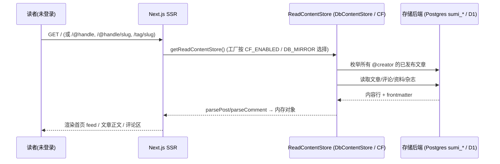

### 6.3 写作与发布（登录用户）

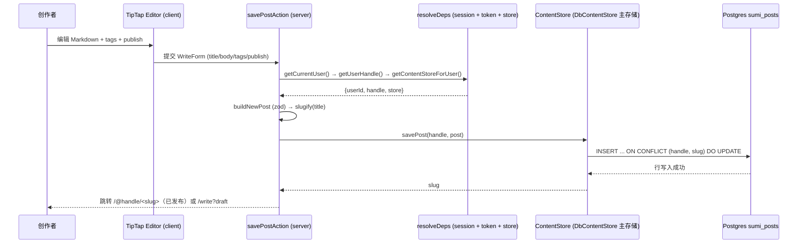

### 6.4 图片上传

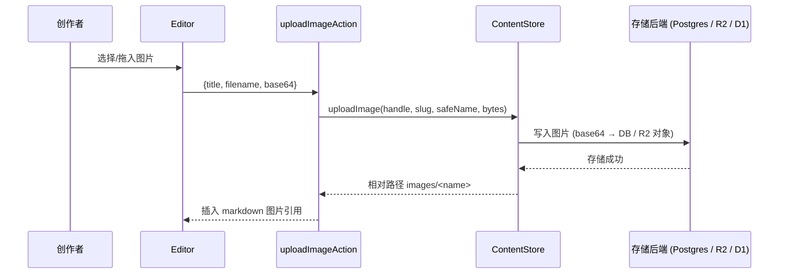

### 6.5 评论

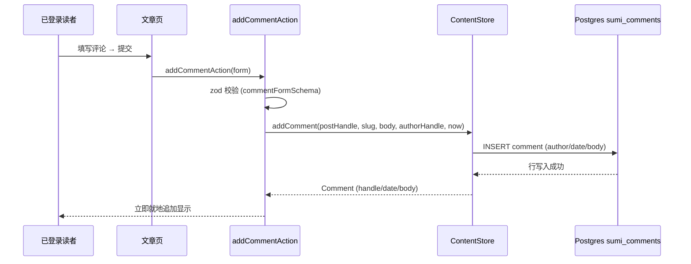

### 6.6 杂志（合集）与 6.7 资料

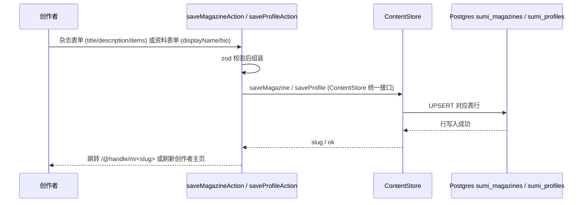

### 6.8 部署拓扑（Docker 一键 + Cloudflare + 自定义 VPS）

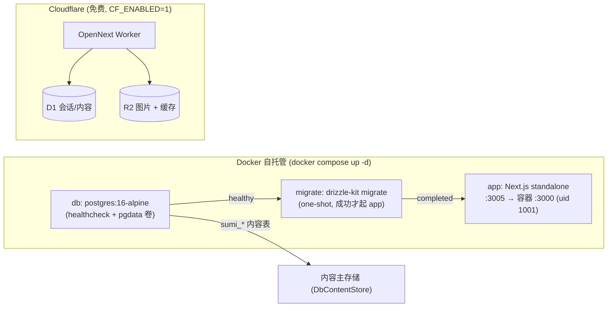

- **Docker 一键**: `docker compose up -d --build`，宿主端口 `:3005` 映射容器 `:3000`。`migrate` 与 `app` 通过 `depends_on: service_completed_successfully` 保证迁移先行（`Dockerfile` / `docker-compose.yml`）。
- **Postgres 为主**: `DB_MIRROR=1` 时内容读写/搜索全部走内置 Postgres 的
  `sumi_*` 表（`DbContentStore`）。
- **Cloudflare 免费托管**: `pnpm cf:build && pnpm cf:deploy`，OpenNext 把 Next 构建为 Worker；会话/内容走 D1（`DB` 绑定），图片走 R2（`IMAGES` 绑定），前置资源创建见 §11.2。
- **自定义 VPS**: `bash scripts/deploy-vps.sh` 幂等安装 Node/pnpm/PM2、构建、迁移并常驻运行。
- `env_file: .env` 注入配置；`BETTER_AUTH_TRUSTED_ORIGINS` 用于信任本地代理来源（如内置浏览器 `app.sumi.orb.local`），详见 `README` 的 Docker 一节。

### 6.9 Agent 自动化发布（MCP）

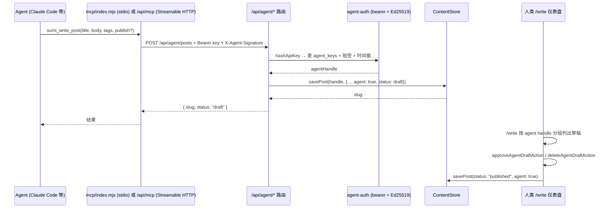

- 双因子认证：bearer key 标识 + Ed25519 签名（`method + path + body + timestamp`
  规范化串），时间窗防重放；泄露 bearer key 无法冒用（`src/lib/agent-auth.ts`、
  `src/lib/agent-signature.ts`）。
- 安全默认：agent 写入一律先落 **draft**，人类在 `/write` 审批后才发布；
  草稿带 `agent: true` 标记并归属 `agent_keys.agent_handle`。
- 同一套 `ContentStore` 接缝 → GitHub / Postgres 镜像 / Cloudflare D1 三种后端
  无需改动即可支持 agent 发布；远程 MCP 仅限长驻 Node 运行时（Docker / VPS）。

### 6.10 AI 总结生成（共读）

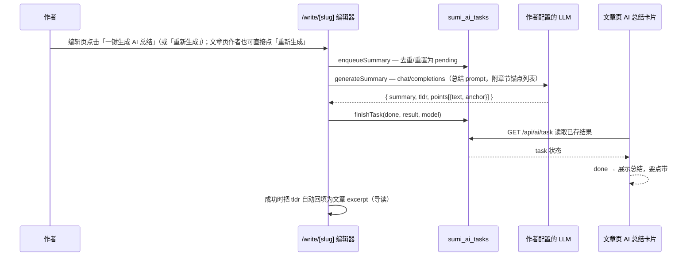

- 作者在 `/settings → AI 总结` 配置 provider（OpenAI 兼容：OpenAI / DeepSeek /
  Moonshot / Ollama / OpenCode Zen 等），`testProvider` 提供「测试连接」。
- 生成是**手动**的：发布文章不会自动创建任务；作者在编辑页点击按钮才会生成，
  不满意可随时「重新生成」。登录作者在文章页的 AI 总结卡片上也能直接重新生成
  （复用同一个 `generateSummaryAction`），不必回编辑器。没有后台任务执行器，
  `generateSummaryAction` 在请求内同步完成生成并落库；文章页短时轮询只为等待
  该请求完成。
- **导读（excerpt）自动回填**：生成成功且是作者自己的文章时，把 AI 总结的
  `tldr`（截断 200 字）写回文章的 `excerpt` 字段——列表卡片、SEO description
  与全文搜索都会自动获得一句话导读，无需手动维护；agent 文章保留原 excerpt。
  「导读」因此保留为 AI 总结的自动派生物（卡片/SEO/RSS 用一句话摘要），与文章
  页的完整「AI 总结」卡片职责不同、互不重复。
- 总结要点返回 `anchor`（文章小标题 slug），正文标题由 `Markdown` 渲染为带
  `id` 的锚点，要点即可点击跳转到对应章节；锚点不在正文中时降级为纯文本。
- 失败不会破坏编辑流程：`generateSummaryAction` 内部 try/catch，失败时任务
  标记为 failed 并返回错误提示，作者可配置后重试。

---

## 7. 目录结构与职责速查

| 路径 | 职责 |
|---|---|
| `src/app/` | App Router 页面与路由（SSR + Server Actions + API） |
| `src/components/` | 客户端 UI 组件（编辑器、表单、卡片、导航） |
| `src/content/` | 内容层:`ContentStore` 接口、GitHub 实现、frontmatter、路径、feed |
| `src/lib/` | 基础设施:auth、env、db、github 客户端、session、user、allowlist |
| `src/db/schema.ts` | Drizzle 表结构（认证/会话 + agent_keys） |
| `src/app/api/agent/` | agent 发布 REST 路由（me / posts CRUD / images） |
| `src/app/api/mcp/` | 远程 Streamable HTTP MCP 服务器（会话注册表 + 限流） |
| `mcp/` | 零依赖 stdio MCP 服务器 + 签名客户端（`index.mjs` / `lib/sign.mjs`） |
| `drizzle/` | 迁移文件（`db:generate` / `db:migrate`） |
| `docs/` | PRD / 架构文档 / 计划 |

---

## 8. 关键设计决策与取舍

1. **内容与会话都放自己的数据库** —— Postgres `sumi_*` 表（Docker/VPS/Vercel）或
   Cloudflare D1+R2 承载全部内容，创作者完全掌控、可导出、可版本化。
2. **统一 `ContentStore` 抽象** —— `DbContentStore`（Postgres 主存储）/
   `CloudflareContentStore` 两个实现共享同一接口，按
   `CF_ENABLED` / `DB_MIRROR` 环境开关选择（工厂见 `src/content/index.ts`）。
3. **slug 派生自标题** —— 改标题会产生新路径（旧文件被孤儿化），代码注释明确提示;这是 v0 的取舍。
4. **登录安全阀（fail-closed + 双重门禁 + origin 白名单 + 限流 + 审计 + CSP）** —— `ALLOWED_GITHUB_USERS`
   为空时拒绝所有人（生产环境启动即报错，防误配置锁死）；每次登录与每个请求都
   重新校验 allowlist，移除用户即立即吊销会话；Better Auth 内置按 IP 限流
   （sign-in 3 次/10 秒、OAuth 回调 10 次/分）+ 路由层 30 次/分兜底，被拒绝的
   登录尝试输出 `[security]` 审计日志；`BETTER_AUTH_TRUSTED_ORIGINS` 白名单兜底
   CSRF；每请求 nonce 的 CSP 与 HTTPS 专属 HSTS 封堵 XSS 与降级攻击；AI provider
   密钥 AES-256-GCM 加密落库。详见 6.1。
5. **一切读写走存储层/HTTP** —— 无本地 FS 写入，图片以 base64 入库（或 R2
   对象），天然 serverless 可移植。
6. **惰性单例 (Proxy)** —— `env / db / auth` 均在首次访问才初始化，避免测试与构建期触发副作用。
7. **正则校验前置** —— `env.ts` 用 zod 在启动期暴露配置错误（如 `DATABASE_URL`、GitHub 凭据）。
8. **单体优于前后端分离** —— 保持 Next.js 全栈单体（App Router RSC + Server
   Actions + Postgres），不拆 React SPA：认证/授权全部在服务端执行，无 CORS、
   CSRF 面与客户端密钥泄露面；RSC 让公开页零 JS 首屏、按需流式加载，性能与
   安全优于 SPA + API 的拆分形态，且单容器部署、运维面最小。

---

## 9. 测试与验证

- **单元测试**: Vitest 29 个文件 / 209 个用例，覆盖 frontmatter 序列化、路径与 slug、feed 排序、搜索相关性、Server Action 核心（用依赖注入注入 `store`/`now`）、GitHub/Cloudflare store 集成（mock）、auth 门禁（PGlite 内存库）、评论深度与删除、登录审计日志与生产配置守卫（含 `BETTER_AUTH_TRUSTED_ORIGINS`）、密钥落库加密（AES-GCM 往返 / 篡改 / 旧明文兼容）。
- **质量门禁**: `pnpm typecheck`、`pnpm test`、`pnpm lint`、`pnpm build`、以及 Docker 冒烟（`docker compose up -d` + `curl :3005` = 200）。

---

## 10. 环境变量一览（`src/lib/env.ts` 强校验）

| 变量 | 必填 | 说明 |
|---|---|---|
| `DATABASE_URL` | ✅ | Postgres/Neon 连接串（Docker 默认 `postgresql://sumi:sumi@db:5432/sumi`） |
| `BETTER_AUTH_SECRET` | ✅ | 会话签名密钥（≥32 字符） |
| `BETTER_AUTH_URL` | ✅ | 应用公开地址（默认 `http://localhost:3000`） |
| `BETTER_AUTH_TRUSTED_ORIGINS` | ⭕ | 额外信任的 auth 来源，逗号分隔（如本地代理/自定义域名） |
| `GITHUB_CLIENT_ID` / `GITHUB_CLIENT_SECRET` | ✅ | GitHub OAuth App 凭据 |
| `ALLOWED_GITHUB_USERS` | ⭕ | 允许登录的用户名，逗号分隔（空 = 拒绝所有人） |
| `DB_MIRROR` | ⭕ | Postgres 主存储开关（置 "1" 时内容读写/搜索走 `sumi_*` 表，推荐开启） |
| `CF_ENABLED` | ⭕ | Cloudflare 运行开关（置 "1" 时命中 CF 内容后端；Docker/VPS 留空） |

---

## 11. 部署目标与运行时存储后端

Sumi 的单一代码库可部署到三种目标，它们共享同一套 `next.config.ts`（`output: "standalone"`）与同一份 zod env schema，互不影响：

| 部署路径 | 命令/方式 | 数据层 | 说明 |
|---|---|---|---|
| **1. Docker 一键** | `docker compose up -d --build` | 内置 Postgres（`sumi_*` 内容表） | 开箱即用，compose 自动执行迁移后启动应用；`DB_MIRROR=1` 即内容主存储 |
| **2. 自定义 VPS** | `bash scripts/deploy-vps.sh` | 自有 Postgres/Neon（`sumi_*` 内容表） | 脚本幂等安装 Node/pnpm/PM2、构建、迁移并常驻运行 |
| **3. Cloudflare (Workers/OpenNext)** | `pnpm cf:build && pnpm cf:deploy` | D1 绑定 `DB` + R2 绑定 `IMAGES` | OpenNext 把 Next 构建成 Worker，数据走 CF 绑定 |

> 备注：Cloudflare 是**首选免费路径**（`CF_ENABLED=1` 时内容走 D1+R2），
> Docker/VPS/Vercel 默认走 Postgres `sumi_*` 内容表（`DB_MIRROR=1`）。三条路径
> 共享同一套 `ContentStore` 抽象与 env 校验，可随时切换。

### 11.1 运行时如何选择存储后端（ContentStore 工厂）

所有内容读写都经由 `src/content/store.ts` 的 `ContentStore` 接口。**具体工厂函数由编排方（orchestrator）负责实现**，本文件仅说明其选择模型：

```text
env.CF_ENABLED 是否为真？
├─ 是 → 构造 Cloudflare 后端（D1 绑定 `DB` + R2 绑定 `IMAGES` 传入 Binding 层）
└─ 否 → DB_MIRROR=1 且 DATABASE_URL 可用？
         ├─ 是 → 构造 Postgres 主存储后端（DbContentStore）
         └─ 否 → 无可用内容后端（返回 null，调用方按空状态处理）
```

要点：
- `ContentStore` 接口（`src/content/store.ts`）保持不变；Postgres 镜像 / Cloudflare D1+R2 两个实现都实现同一接口，保证 Server Actions / 页面只依赖抽象（工厂见 `src/content/index.ts`）。
- `env.CF_ENABLED` 是唯一提示键（见 §10）。CF 绑定（D1/R2）由 `wrangler.jsonc` 声明并在 Worker 运行时注入，**不会**以 `process.env` 形式出现。
- 两种目标共用同一套 GitHub OAuth 认证与会话表（Postgres 或 D1 建模由各后端负责）。
- 推荐配置（Docker/VPS/Vercel）为 `DB_MIRROR=1`：内容写入只进 Postgres
  `sumi_*` 表。

### 11.2 Cloudflare 前置资源

`wrangler.jsonc` 声明了以下绑定，部署前需用 wrangler 创建并回填 ID：

```bash
pnpm dlx wrangler d1 create sumi-db                 # → 回填 database_id 到 wrangler.jsonc
pnpm dlx wrangler r2 bucket create sumi-opennext-cache
pnpm dlx wrangler r2 bucket create sumi-images
```

D1 内容表建表（Postgres 方言的 `drizzle/*.sql` 不适用于 D1，请用专用 D1 DDL）：

```bash
pnpm dlx wrangler d1 execute sumi-db --remote --file=drizzle/d1-schema.sql
```

D1/R2 的运行时访问由 Worker 绑定（`DB` / `IMAGES`）提供，不经过 `src/lib/db.ts` 的 Postgres 驱动。

---

> 相关文档: [PRD](docs/PRD.md) · 设计稿 `docs/superpowers/specs/2026-06-12-open-source-note-platform-design.md` · 使用教程见 `README.md`
